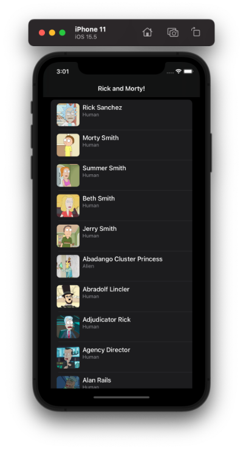

# Inditex
Technical test for the Inditex Group (ZARA)

# Documentation:
- I have selected VIP pattern (a.k.a. "Clean Swift")
- Calling to the API has been made without any third library. In my opinion it is not necessary nowadays at all.
- Just for lack of time, I did NOT add any other extra feature: SearchBar, localized strings...

# How to test
- Clone the project
- Run the project 🥳

Screenshots Light and Dark theme:

Screenshots Details View and Error View:

Visit my blog for more info: [www.oscargarrucho.com](http://www.oscargarrucho.com/)

MIT License

Copyright (c) 2018 Chester How

Permission is hereby granted, free of charge, to any person obtaining a copy of this software and associated documentation files (the "Software"), to deal in the Software without restriction, including without limitation the rights to use, copy, modify, merge, publish, distribute, sublicense, and/or sell copies of the Software, and to permit persons to whom the Software is furnished to do so, subject to the following conditions:

The above copyright notice and this permission notice shall be included in all copies or substantial portions of the Software.

THE SOFTWARE IS PROVIDED "AS IS", WITHOUT WARRANTY OF ANY KIND, EXPRESS OR IMPLIED, INCLUDING BUT NOT LIMITED TO THE WARRANTIES OF MERCHANTABILITY, FITNESS FOR A PARTICULAR PURPOSE AND NONINFRINGEMENT. IN NO EVENT SHALL THE AUTHORS OR COPYRIGHT HOLDERS BE LIABLE FOR ANY CLAIM, DAMAGES OR OTHER LIABILITY, WHETHER IN AN ACTION OF CONTRACT, TORT OR OTHERWISE, ARISING FROM, OUT OF OR IN CONNECTION WITH THE SOFTWARE OR THE USE OR OTHER DEALINGS IN THE SOFTWARE.
